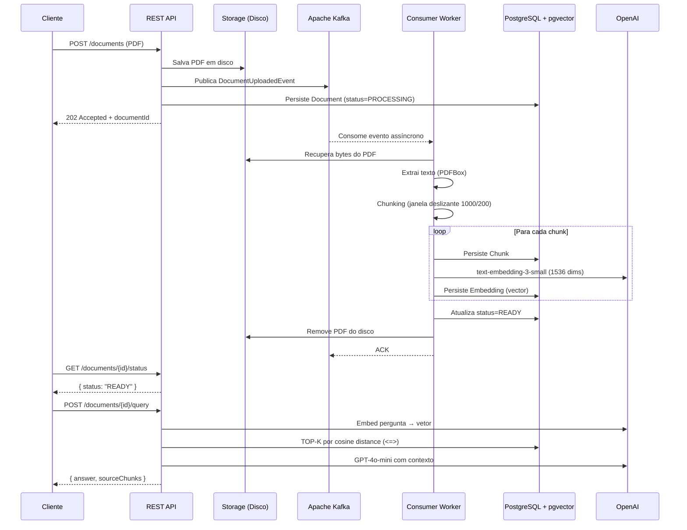

<div align="center">

# 📄 Document Intelligence API

**Pipeline RAG assíncrono para consulta inteligente de documentos PDF via linguagem natural**

[](https://openjdk.org/projects/jdk/21/)
[](https://spring.io/projects/spring-boot)
[](https://spring.io/projects/spring-ai)
[](https://kafka.apache.org/)
[](https://github.com/pgvector/pgvector)
[](https://platform.openai.com/)
[](LICENSE)

</div>

---

## 📌 Sobre o Projeto

**Document Intelligence API** é uma API REST de produção que implementa o padrão **RAG (Retrieval-Augmented Generation)** para permitir que usuários façam perguntas em linguagem natural sobre documentos PDF enviados.

O diferencial desta implementação está na sua **arquitetura orientada a eventos**: o processamento pesado (extração de texto, chunking, geração de embeddings) acontece de forma **completamente assíncrona** via Apache Kafka, desacoplando o upload da resposta HTTP e garantindo escalabilidade e resiliência.

### Por que este projeto é interessante?

| Aspecto | Decisão de Design |
|---|---|
| **Escalabilidade** | Processamento assíncrono via Kafka — a API retorna 202 imediatamente |
| **Resiliência** | Dead Letter Queue após 2 retries — falhas transitórias não perdem mensagens |
| **Busca semântica** | pgvector com IVFFlat index — similaridade de cosseno em vetores de 1536 dimensões |
| **Atomicidade** | `TransactionTemplate` programático para chunk+embedding — sem dados parciais no banco |
| **Desacoplamento** | Interfaces `EmbeddingProvider` e `LlmProvider` — troca de provedor sem alterar o core |
| **Segurança** | Validação de path traversal no upload, ProblemDetail (RFC 7807) em todos os erros |

---

## 🏗️ Arquitetura

### Fluxo do Pipeline RAG



### Padrão Claim Check

O evento Kafka carrega apenas referência ao arquivo (`filePath`), não os bytes do PDF. Isso evita payloads gigantes no broker e segue o padrão **Claim Check** do Enterprise Integration Patterns.

### Dead Letter Queue

```
document-uploaded → [retry 1s] → [retry 1s] → document-uploaded.DLQ
```

Falhas transientes (rate limit OpenAI, rede, etc.) são reprocessadas automaticamente. Falhas permanentes (PDF corrompido, imagem-only) são roteadas para a DLQ sem loop infinito.

---

## 🛠️ Stack Tecnológica

### Backend
| Tecnologia | Versão | Papel |
|---|---|---|
| **Java** | 21 | Linguagem base (Records, Pattern Matching, Virtual Threads-ready) |
| **Spring Boot** | 3.3.5 | Framework principal |
| **Spring AI** | 1.0.0 | Abstração para LLM e Embedding providers |
| **Spring Kafka** | (BOM) | Producer/Consumer com ack manual |
| **Spring Retry** | (BOM) | `@Retryable` exponential backoff no embedding |
| **Spring Data JPA** | (BOM) | Repositórios + `@Modifying` para update atômico |
| **Flyway** | (BOM) | Migrations versionadas (V1→V3) |
| **Apache PDFBox** | 3.0.3 | Extração de texto de PDFs |
| **Springdoc OpenAPI** | 2.6.0 | Swagger UI automático |
| **Lombok** | (BOM) | Boilerplate reduction |

### Infraestrutura
| Tecnologia | Versão | Papel |
|---|---|---|
| **PostgreSQL** | 15 | Banco relacional |
| **pgvector** | 0.1.6 | Extensão para busca vetorial (IVFFlat cosine) |
| **Apache Kafka** | 7.4.0 (CP) | Message broker — desacoplamento assíncrono |
| **OpenAI** | GPT-4o-mini / text-embedding-3-small | LLM + Embeddings |

### Testes
| Tecnologia | Papel |
|---|---|
| **JUnit 5 + Mockito** | 33 testes unitários |
| **Testcontainers** | Integração com PostgreSQL real (pgvector) + Kafka real |
| **Awaitility** | Polling assíncrono para testes de consumer |
| **AssertJ** | Assertions fluentes |

---

## 🚀 Como Rodar

### Pré-requisitos

- [Docker](https://www.docker.com/) e Docker Compose
- [JDK 21+](https://adoptium.net/)
- Uma [chave de API da OpenAI](https://platform.openai.com/api-keys)

### 1. Clone o repositório

```bash
git clone https://github.com/SEU_USUARIO/document-intelligence-api.git
cd document-intelligence-api
```

### 2. Configure as variáveis de ambiente

```bash
cp .env.example .env
```

Edite o `.env` e preencha sua chave da OpenAI:

```env
OPENAI_API_KEY=sk-proj-...
POSTGRES_DB=documentdb
POSTGRES_USER=postgres
POSTGRES_PASSWORD=postgres
```

### 3. Suba o stack completo com Docker Compose

```bash
docker compose up --build
```

Isso irá iniciar:
- **PostgreSQL 15** com extensão `pgvector` na porta `5432`
- **Apache Kafka** (Confluent Platform 7.4.0) na porta `9092`
- **Zookeeper** (dependência do Kafka)
- **API** (Spring Boot) na porta `8080`

> O Flyway roda automaticamente as migrations ao iniciar a aplicação. O banco estará pronto em ~15s.

### 4. Verifique a saúde da aplicação

```bash
curl http://localhost:8080/actuator/health
```

Resposta esperada:
```json
{
  "status": "UP",
  "components": {
    "db": { "status": "UP" },
    "kafka": { "status": "UP" }
  }
}
```

### Apenas a infraestrutura (desenvolvimento local)

Se preferir rodar a API fora do Docker (ex: no IntelliJ/VS Code):

```bash
# Sobe apenas PostgreSQL e Kafka
docker compose up postgres zookeeper kafka

# Em outro terminal, rode a aplicação
./mvnw spring-boot:run -Dspring-boot.run.arguments="--OPENAI_API_KEY=sk-proj-..."
```

---

## 📡 Exemplos de Uso da API

A documentação interativa (Swagger UI) está disponível em: **http://localhost:8080/swagger-ui.html**

---

### 1. Upload de um PDF

```bash
curl -X POST http://localhost:8080/documents \
  -H "Content-Type: multipart/form-data" \
  -F "file=@/caminho/para/seu/documento.pdf"
```

**Resposta** `202 Accepted`:
```json
{
  "documentId": "3fa85f64-5717-4562-b3fc-2c963f66afa6"
}
```

> O processamento acontece em background. Use o `documentId` para verificar o status.

---

### 2. Verificar status do processamento

```bash
curl http://localhost:8080/documents/3fa85f64-5717-4562-b3fc-2c963f66afa6/status
```

**Resposta enquanto processa** `200 OK`:
```json
{
  "documentId": "3fa85f64-5717-4562-b3fc-2c963f66afa6",
  "status": "PROCESSING",
  "filename": "relatorio-anual-2024.pdf"
}
```

**Resposta quando pronto** `200 OK`:
```json
{
  "documentId": "3fa85f64-5717-4562-b3fc-2c963f66afa6",
  "status": "READY",
  "filename": "relatorio-anual-2024.pdf"
}
```

| Status | Significado |
|---|---|
| `PROCESSING` | PDF na fila/sendo processado |
| `READY` | Embeddings gerados, pronto para queries |
| `FAILED` | Erro no processamento (PDF imagem-only, corrompido, etc.) |

---

### 3. Consultar o documento em linguagem natural

```bash
curl -X POST http://localhost:8080/documents/3fa85f64-5717-4562-b3fc-2c963f66afa6/query \
  -H "Content-Type: application/json" \
  -d '{ "question": "Qual foi o lucro líquido no segundo trimestre?" }'
```

**Resposta** `200 OK`:
```json
{
  "answer": "Conforme o relatório, o lucro líquido no segundo trimestre foi de R$ 4,2 bilhões, representando crescimento de 18% em relação ao mesmo período do ano anterior.",
  "sourceChunks": [
    "...no 2T24, a companhia registrou lucro líquido de R$ 4,2 bilhões (crescimento de 18% a/a)...",
    "...a margem EBITDA ajustada atingiu 32,4% no segundo trimestre, impulsionada por..."
  ]
}
```

---

### Tratamento de Erros (RFC 7807 — Problem Details)

Todos os erros seguem o padrão `application/problem+json`:

```bash
# Tentativa de query em documento ainda processando
curl -X POST http://localhost:8080/documents/SEU_ID/query \
  -H "Content-Type: application/json" \
  -d '{ "question": "pergunta" }'
```

```json
{
  "type": "about:blank",
  "title": "Conflict",
  "status": 409,
  "detail": "Document is not ready for querying. Current status: PROCESSING"
}
```

| Cenário | HTTP Status |
|---|---|
| Documento não encontrado | `404 Not Found` |
| Documento não está READY | `409 Conflict` |
| Arquivo não é PDF | `400 Bad Request` |
| Arquivo maior que 10MB | `400 Bad Request` |
| Filename ausente | `400 Bad Request` |
| Kafka indisponível | `503 Service Unavailable` |
| OpenAI indisponível | `502 Bad Gateway` |

---

## 🗂️ Estrutura do Projeto

```
document-intelligence-api/
├── src/main/java/com/example/documentintelligence/
│   ├── api/
│   │   ├── DocumentController.java        # REST endpoints (upload, status, query)
│   │   ├── GlobalExceptionHandler.java    # RFC 7807 ProblemDetail
│   │   └── dto/                           # UploadResponse, StatusResponse, QueryRequest/Response
│   ├── config/
│   │   ├── KafkaConfig.java               # DefaultErrorHandler + DLQ routing
│   │   ├── OpenAiConfig.java              # Bean wiring para EmbeddingProvider e LlmProvider
│   │   └── StorageConfig.java             # Bean wiring para FileSystemStorageService
│   ├── domain/
│   │   ├── Document.java                  # @Entity com @PrePersist
│   │   ├── Chunk.java                     # @Entity — fragmentos de texto
│   │   ├── Embedding.java                 # @Entity — @JdbcTypeCode(VECTOR) float[1536]
│   │   └── DocumentStatus.java            # PROCESSING | READY | FAILED
│   ├── exception/                         # Hierarquia de exceções de domínio
│   ├── repository/
│   │   ├── DocumentRepository.java        # @Modifying updateStatusById
│   │   ├── ChunkRepository.java           # findByDocumentId
│   │   └── EmbeddingRepository.java       # @Query nativa com operador <=> (cosine)
│   └── service/
│       ├── DocumentService.java           # upload() CRIT-1: store→publish→persist
│       ├── ai/
│       │   ├── EmbeddingProvider.java     # Interface (Strategy Pattern)
│       │   ├── LlmProvider.java           # Interface (Strategy Pattern)
│       │   └── openai/                    # OpenAiEmbeddingProvider (@Retryable 3x)
│       ├── kafka/
│       │   ├── DocumentEventConsumer.java # @KafkaListener + TransactionTemplate
│       │   ├── DocumentEventProducer.java # KafkaTemplate
│       │   └── event/DocumentUploadedEvent.java  # Record (Claim Check)
│       ├── processing/
│       │   ├── PdfExtractor.java          # PDFBox 3.x — Loader.loadPDF()
│       │   └── TextChunker.java           # Sliding window (1000 chars / 200 overlap)
│       └── storage/
│           ├── StorageService.java        # Interface
│           └── FileSystemStorageService.java  # Path traversal safe
│
├── src/main/resources/
│   ├── application.yml                    # Configuração via env vars
│   └── db/migration/
│       ├── V1__create_documents.sql
│       ├── V2__create_chunks.sql
│       └── V3__create_embeddings_pgvector.sql  # CREATE EXTENSION vector + IVFFlat index
│
├── src/test/java/.../
│   ├── service/                           # 33 testes unitários (MockitoExtension)
│   └── integration/
│       ├── AbstractIntegrationTest.java   # Testcontainers Singleton Pattern
│       ├── DocumentIntegrationTest.java   # HTTP pipeline completo
│       ├── KafkaConsumerIntegrationTest.java  # Kafka → DB state
│       └── PgVectorSearchTest.java        # @DataJpaTest cosine similarity
│
└── docker-compose.yml                     # postgres+pgvector, kafka, zookeeper, app
```

---

## 🔬 Testes

```bash
# Testes unitários (sem Docker)
./mvnw test -Dtest="!*IntegrationTest,!PgVectorSearchTest"

# Testes de integração (requer Docker)
./mvnw test -Dtest="*IntegrationTest,PgVectorSearchTest"

# Todos os testes
./mvnw verify
```

| Suite | Quantidade | Requer Docker |
|---|---|---|
| Unitários | 33 | Não |
| Integração (HTTP pipeline) | 1 | Sim |
| Integração (Kafka consumer) | 1 | Sim |
| Integração (pgvector search) | 2 | Sim |
| **Total** | **37** | — |

Os testes de integração utilizam **Testcontainers** para subir instâncias reais de PostgreSQL (`pgvector/pgvector:pg15`) e Kafka (`confluentinc/cp-kafka:7.4.0`) — sem mocks de infraestrutura.

---

## ⚙️ Variáveis de Ambiente

| Variável | Default | Descrição |
|---|---|---|
| `OPENAI_API_KEY` | **(obrigatório)** | Chave da API OpenAI |
| `SPRING_DATASOURCE_URL` | `jdbc:postgresql://localhost:5432/documentdb` | URL do banco |
| `SPRING_DATASOURCE_USERNAME` | `postgres` | Usuário do banco |
| `SPRING_DATASOURCE_PASSWORD` | `postgres` | Senha do banco |
| `KAFKA_BOOTSTRAP_SERVERS` | `localhost:9092` | Endereço do Kafka |
| `PDF_STORAGE_PATH` | `/tmp/pdf-storage` | Diretório de armazenamento temporário dos PDFs |
| `APP_RAG_CHUNK_SIZE` | `1000` | Tamanho de cada chunk em caracteres |
| `APP_RAG_CHUNK_OVERLAP` | `200` | Sobreposição entre chunks (sliding window) |
| `APP_RAG_TOP_K` | `5` | Número de chunks retornados pela busca vetorial |

---

## 🧠 Decisões Técnicas Relevantes

### ADR-001 — Claim Check Pattern no Kafka
O evento `DocumentUploadedEvent` transporta apenas o `filePath`, não os bytes do PDF. Isso mantém o payload do Kafka pequeno e evita problemas com o limite de tamanho de mensagem (~1MB default).

### ADR-002 — TransactionTemplate Programático
O loop de chunk+embedding usa `TransactionTemplate` ao invés de `@Transactional` por anotação. Isso evita o problema clássico de **AOP self-invocation bypass** em Spring, onde uma chamada `this.metodo()` não passa pelo proxy e ignora a transação.

### ADR-003 — `updateStatusById` com `@Modifying`
A atualização de status do documento usa uma query JPQL direta (`UPDATE Document d SET d.status...`) em vez de load→modify→save. Isso funciona corretamente mesmo no bloco `catch` do consumer, onde não há contexto transacional ativo.

### ADR-004 — CRIT-1: Kafka antes do Banco
A ordem no `upload()` é: `store → publish → persist`. Se o Kafka falhar, o arquivo é deletado e 503 é retornado — sem registro fantasma no banco. Se o banco falhar após a publicação, o consumer tentará processar um documento inexistente, mas o `updateStatusById(FAILED)` simplesmente não encontrará linhas para atualizar, sem corrupção de dados.

---

## 📄 Licença

Este projeto está sob a licença [MIT](LICENSE).

---

<div align="center">

**Desenvolvido como projeto de portfólio — demonstrando arquitetura orientada a eventos, RAG pipeline, e boas práticas de engenharia em Java/Spring Boot.**

</div>
