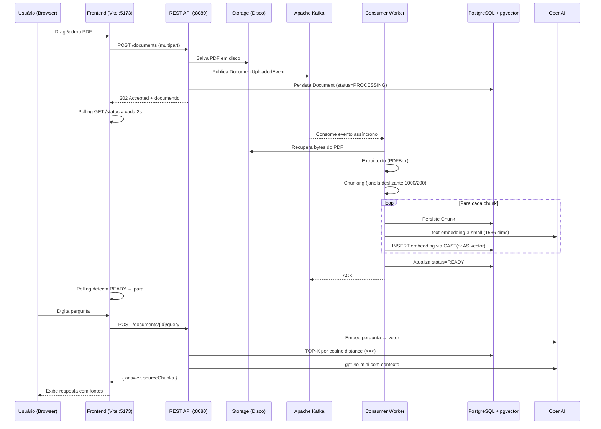

<div align="center">

# 📄 Document Intelligence

**Full Stack RAG — pipeline assíncrono para consulta inteligente de documentos PDF via linguagem natural**

[](https://openjdk.org/projects/jdk/21/)
[](https://spring.io/projects/spring-boot)
[](https://react.dev/)
[](https://vitejs.dev/)
[](https://tailwindcss.com/)
[](https://kafka.apache.org/)
[](https://github.com/pgvector/pgvector)
[](https://platform.openai.com/)
[](LICENSE)

</div>

---

## 📌 Sobre o Projeto

**Document Intelligence** é uma aplicação **Full Stack** que implementa o padrão **RAG (Retrieval-Augmented Generation)**. O usuário faz upload de um PDF pela interface web, aguarda o processamento assíncrono e pode então fazer perguntas em linguagem natural sobre o conteúdo do documento.

### Stack completa

| Camada | Tecnologias |
|---|---|
| **Frontend** | React 18 + TypeScript, Vite 5, Tailwind CSS 3, shadcn/ui, framer-motion, TanStack Query 5 |
| **Backend** | Java 21, Spring Boot 3.3.5, Spring AI, Spring Kafka |
| **Mensageria** | Apache Kafka (Confluent 7.4.0) |
| **Banco de Dados** | PostgreSQL 15 + pgvector (busca vetorial cosine) |
| **IA** | OpenAI `gpt-4o-mini` (LLM) + `text-embedding-3-small` (1536 dims) |

### Por que este projeto é interessante?

| Aspecto | Decisão de Design |
|---|---|
| **Escalabilidade** | Processamento assíncrono via Kafka — API retorna `202` imediatamente |
| **Resiliência** | Dead Letter Queue após 2 retries — falhas transitórias não perdem mensagens |
| **Busca semântica** | pgvector com IVFFlat index — similaridade de cosseno em 1536 dimensões |
| **Atomicidade** | `TransactionTemplate` programático para chunk+embedding — sem dados parciais |
| **Desacoplamento** | Interfaces `EmbeddingProvider` e `LlmProvider` — troca de provedor sem alterar o core |
| **UX reativa** | React Query polling a cada 2s durante `PROCESSING`, para automaticamente em `READY`/`FAILED` |

---

## 🏗️ Arquitetura

### Fluxo do Pipeline RAG



---

## 🚀 Como Rodar

### Pré-requisitos

- [Docker](https://www.docker.com/) e Docker Compose
- [Node.js 18+](https://nodejs.org/) e npm
- Uma [chave de API da OpenAI](https://platform.openai.com/api-keys)

### 1. Clone o repositório

```bash
git clone https://github.com/SEU_USUARIO/document-intelligence-api.git
cd document-intelligence-api
```

### 2. Configure as variáveis de ambiente

```bash
cp .env.example .env
```

Edite o `.env` e preencha sua chave da OpenAI:

```env
OPENAI_API_KEY=sk-proj-...
POSTGRES_DB=documentdb
POSTGRES_USER=postgres
POSTGRES_PASSWORD=postgres
```

### 3. Suba a infraestrutura com Docker

**Terminal 1 — Backend + Infraestrutura:**

```bash
docker compose up --build
```

Isso inicia:
- **PostgreSQL 15** com `pgvector` na porta `5432`
- **Apache Kafka** na porta `9092`
- **Zookeeper** (dependência do Kafka)
- **API Spring Boot** na porta `8080`

Aguarde até ver no log:
```
Started DocumentIntelligenceApplication in X seconds
```

Verifique a saúde:
```bash
curl http://localhost:8080/actuator/health
# → {"status":"UP"}
```

### 4. Suba o frontend

**Terminal 2 — Frontend (dev server com hot reload):**

```bash
cd frontend
npm install
npm run dev
```

Acesse: **http://localhost:5173**

> O Vite está configurado com proxy reverso: requisições para `/documents` são encaminhadas automaticamente para `http://localhost:8080`, eliminando problemas de CORS em desenvolvimento.

---

## 🖥️ Interface

A interface segue o design system **Vibe Pointer**:

- Fundo preto (`zinc-950`) com grid geométrico sutil
- Acentos em gradiente **mint green `#20EFA4` → cyan `#00FFFF`**
- Painéis `zinc-900` com bordas `zinc-800`
- Animações com **framer-motion** (fade, slide, scale)
- Componentes **shadcn/ui** sobre Radix UI

### Fluxo de estados da UI

```
idle → uploading → processing (polling 2s) → ready / failed
```

| Estado | UI |
|---|---|
| `idle` | Upload zone com drag & drop |
| `uploading` | Progress bar animada |
| `processing` | Spinner pulsante — polling automático |
| `ready` | Chat habilitado para perguntas |
| `failed` | Mensagem de erro com opção de retry |

---

## 📡 API REST

Swagger UI disponível em: **http://localhost:8080/swagger-ui.html**

### Upload de PDF

```bash
curl -X POST http://localhost:8080/documents \
  -F "file=@/caminho/para/documento.pdf"
# → 202 {"documentId": "uuid"}
```

### Verificar status

```bash
curl http://localhost:8080/documents/{id}/status
# → {"documentId":"...","status":"READY","filename":"doc.pdf"}
```

### Consultar em linguagem natural

```bash
curl -X POST http://localhost:8080/documents/{id}/query \
  -H "Content-Type: application/json" \
  -d '{"question": "Qual o ponto principal do documento?"}'
# → {"answer":"...","sourceChunks":["...","..."]}
```

### Códigos de status

| Cenário | HTTP |
|---|---|
| Upload aceito | `202 Accepted` |
| Documento não encontrado | `404 Not Found` |
| Documento não está READY | `409 Conflict` |
| Arquivo não é PDF | `400 Bad Request` |
| Arquivo > 10MB | `400 Bad Request` |
| Kafka indisponível | `503 Service Unavailable` |
| OpenAI indisponível | `502 Bad Gateway` |

---

## 🗂️ Estrutura do Projeto

```
document-intelligence-api/
├── frontend/                              # React + Vite + Tailwind
│   ├── src/
│   │   ├── App.tsx                        # State machine (idle→uploading→processing→ready/failed)
│   │   ├── components/
│   │   │   ├── layout/                    # Background grid, layout wrapper
│   │   │   ├── hero/                      # HeroSection com título e subtítulo
│   │   │   ├── upload/                    # UploadZone (drag & drop + progress)
│   │   │   ├── chat/                      # ChatPanel (pergunta + resposta + sourceChunks)
│   │   │   └── ui/                        # shadcn/ui primitives
│   │   ├── hooks/
│   │   │   ├── useDocumentUpload.ts       # Mutation axios → phase uploading
│   │   │   ├── useDocumentStatus.ts       # Query com refetchInterval=2000ms se PROCESSING
│   │   │   └── useDocumentQuery.ts        # Mutation POST /query
│   │   ├── services/api.ts                # Axios client com interceptors
│   │   └── types/                         # TypeScript interfaces (StatusResponse, etc.)
│   ├── vite.config.ts                     # Proxy /documents → localhost:8080
│   └── tailwind.config.ts                 # Tema Vibe Pointer (cores, fontes)
│
├── src/main/java/com/example/documentintelligence/
│   ├── api/
│   │   ├── DocumentController.java        # REST endpoints
│   │   ├── GlobalExceptionHandler.java    # RFC 7807 ProblemDetail
│   │   └── dto/                           # Request/Response DTOs
│   ├── domain/
│   │   ├── Document.java                  # @Entity — sem @GeneratedValue (UUID do serviço)
│   │   ├── Chunk.java                     # Fragmentos de texto
│   │   ├── Embedding.java                 # float[1536] — insert via native SQL
│   │   └── DocumentStatus.java            # PROCESSING | READY | FAILED
│   ├── repository/
│   │   ├── DocumentRepository.java        # @Modifying updateStatusById
│   │   └── EmbeddingRepository.java       # INSERT nativo CAST(:v AS vector) + busca <=>
│   └── service/
│       ├── DocumentService.java           # upload(): store→publish→persist (CRIT-1)
│       ├── ai/                            # EmbeddingProvider + LlmProvider interfaces
│       ├── kafka/                         # Producer, Consumer, Event (Claim Check)
│       ├── processing/                    # PdfExtractor (PDFBox) + TextChunker
│       └── storage/                       # FileSystemStorageService (path-safe)
│
├── src/main/resources/
│   ├── application.yml                    # Config via env vars (model, temperature, RAG params)
│   └── db/migration/                      # Flyway V1→V3 (documents, chunks, embeddings+pgvector)
│
├── src/test/                              # 37 testes (33 unit + 4 integration/Testcontainers)
├── docker-compose.yml                     # postgres, kafka, zookeeper, app
├── Dockerfile                             # Multi-stage: maven build + jre-alpine runtime
└── .env.example                           # Template de variáveis de ambiente
```

---

## ⚙️ Variáveis de Ambiente

| Variável | Default | Descrição |
|---|---|---|
| `OPENAI_API_KEY` | **(obrigatório)** | Chave da API OpenAI |
| `SPRING_DATASOURCE_URL` | `jdbc:postgresql://localhost:5432/documentdb` | URL do banco |
| `SPRING_DATASOURCE_USERNAME` | `postgres` | Usuário do banco |
| `SPRING_DATASOURCE_PASSWORD` | `postgres` | Senha do banco |
| `KAFKA_BOOTSTRAP_SERVERS` | `localhost:9092` | Endereço do Kafka |
| `PDF_STORAGE_PATH` | `/tmp/pdf-storage` | Diretório temporário dos PDFs |
| `APP_RAG_CHUNK_SIZE` | `1000` | Tamanho de cada chunk (caracteres) |
| `APP_RAG_CHUNK_OVERLAP` | `200` | Sobreposição entre chunks |
| `APP_RAG_TOP_K` | `5` | Chunks retornados pela busca vetorial |

### Configuração de IA (`application.yml`)

```yaml
spring:
  ai:
    openai:
      chat:
        options:
          model: gpt-4o-mini      # Trocar por gpt-4o para mais qualidade
          temperature: 0.5        # 0.0 = determinístico, 1.0 = criativo
      embedding:
        options:
          model: text-embedding-3-small
```

---

## 🔬 Testes

```bash
# Unitários (sem Docker — rápidos)
./mvnw test -Dtest="!*IntegrationTest,!PgVectorSearchTest"

# Integração (requer Docker)
./mvnw test -Dtest="*IntegrationTest,PgVectorSearchTest"

# Suite completa
./mvnw verify
```

| Suite | Quantidade | Requer Docker |
|---|---|---|
| Unitários | 33 | Não |
| Integração HTTP pipeline | 1 | Sim |
| Integração Kafka consumer | 1 | Sim |
| Integração pgvector search | 2 | Sim |
| **Total** | **37** | — |

---

## 🧠 Decisões Técnicas (ADRs)

### ADR-001 — Claim Check Pattern no Kafka
O evento `DocumentUploadedEvent` transporta apenas o `filePath`, não os bytes do PDF. Payload pequeno, sem risco de estouro do limite de mensagem (~1MB default do Kafka).

### ADR-002 — TransactionTemplate Programático
O loop chunk+embedding usa `TransactionTemplate` em vez de `@Transactional` por anotação para evitar o problema clássico de **AOP self-invocation bypass** do Spring.

### ADR-003 — `updateStatusById` com `@Modifying`
Atualização de status via query JPQL direta (`UPDATE Document d SET d.status...`) sem load→modify→save. Funciona corretamente mesmo no bloco `catch` do consumer, fora de contexto transacional ativo.

### ADR-004 — Ordem CRIT-1: Kafka antes do Banco
`upload()` segue a ordem: `store → publish → persist`. Se Kafka falhar, o arquivo é deletado e 503 é retornado — sem registro fantasma no banco.

### ADR-005 — UUID gerado pela aplicação, não pelo banco
`Document.id` não usa `@GeneratedValue` — a aplicação gera o UUID com `UUID.randomUUID()` e o persiste explicitamente. Isso garante que o mesmo ID retornado na resposta HTTP seja o ID armazenado no banco e publicado no evento Kafka. Ver `docs/AI-HANDOFF.md` para detalhes do bug que motivou esta decisão.

### ADR-006 — INSERT nativo para embeddings pgvector
`EmbeddingRepository.insertEmbedding()` usa `@Query` nativa com `CAST(:vector AS vector)` em vez de `embeddingRepository.save()`. Hibernate 6.5 com `@JdbcTypeCode(SqlTypes.VECTOR)` envia `float[]` como `bytea` sem configuração extra do driver pgvector — o INSERT nativo bypassa esse mapeamento e é consistente com o operador `<=>` já usado na busca.

---

## 📄 Licença

Este projeto está sob a licença [MIT](LICENSE).

---

<div align="center">

**Full Stack — Spring Boot + Kafka + pgvector + React + Vite + Tailwind**

</div>
